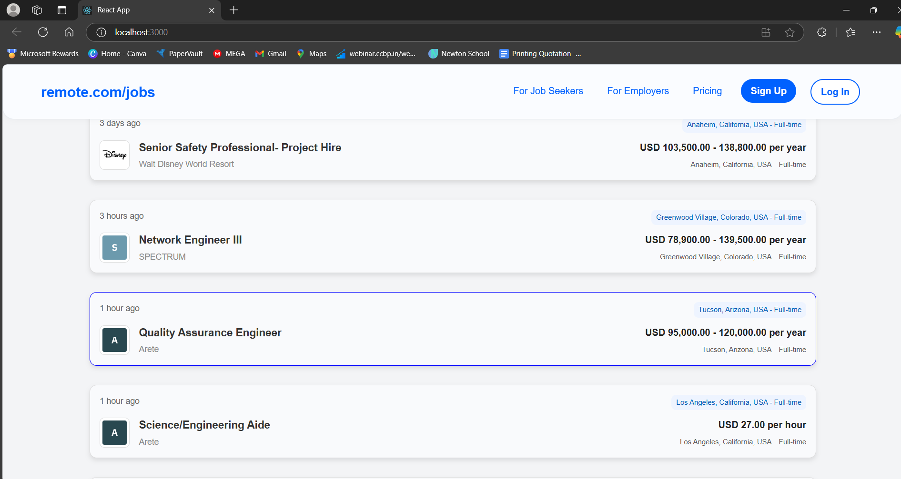
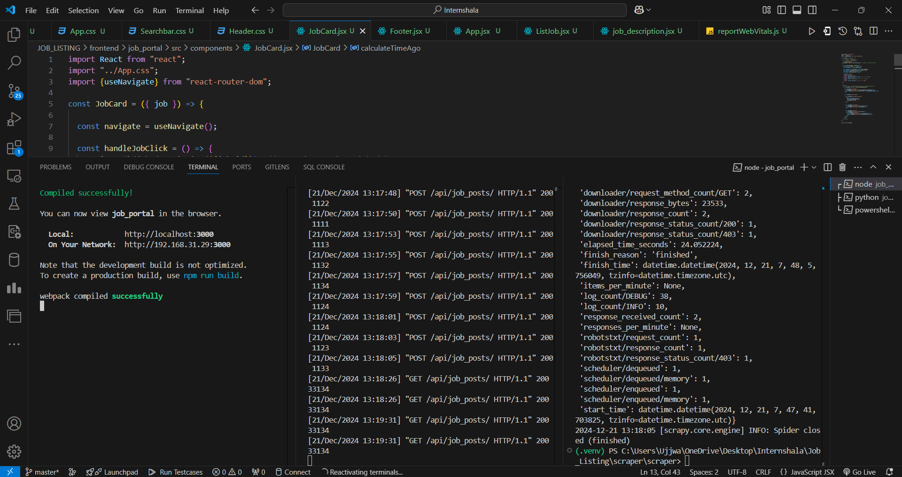
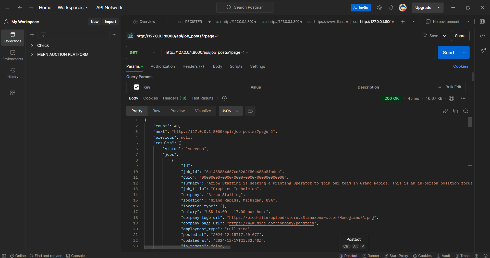

# **Remote Jobs Portal**

A modern web application to browse and manage remote job listings. Built with a Django backend for robust API functionality and a React frontend for an interactive user experience.

---

## **Features**
- **Remote Job Listings**: View detailed information about job roles, companies, salaries, and locations.
- **RESTful API**: Fetch job data seamlessly from the backend using Django REST Framework.
- **Modern UI**: Built with React, providing a clean and responsive user interface.
- **Navigation**: Easy navigation between sections like job seekers, employers, pricing, and account management.
- **Account Actions**: Beautifully styled "Sign Up" and "Log In" buttons for user interaction.

---

## **Technologies Used**
### **Frontend**
- **React**: A JavaScript library for building dynamic user interfaces.
- **Axios**: For API requests and data fetching.
- **CSS**: Custom styles for a clean and modern look.

### **Backend**
- **Django**: Python-based web framework for handling API endpoints and business logic.
- **Django REST Framework (DRF)**: Simplifies API development.
- **SQLite**: Lightweight database for storing job data.

---

## **Getting Started**

### **Prerequisites**
Ensure you have the following installed:
- **Node.js**: For running the React development server.
- **Python**: For running the Django backend.
- **npm or Yarn**: For managing frontend dependencies.

---

### **Setup**

#### 1. **Clone the Repository**
```bash
git clone https://github.com/your-username/remote-jobs-portal.git
cd remote-jobs-portal
```

#### 2. **Backend Setup**
Navigate to the backend directory and install dependencies:
```bash
cd backend
python -m venv env  # Create a virtual environment
source env/bin/activate  # Activate the virtual environment
pip install -r requirements.txt  # Install required Python packages
```

Run the development server:
```bash
python manage.py migrate  # Apply migrations
python manage.py runserver  # Start the server
```
The backend server will be available at `http://127.0.0.1:8000/`.

---

#### 3. **Frontend Setup**
Navigate to the frontend directory and install dependencies:
```bash
cd frontend
npm install
```

Start the development server:
```bash
npm start
```
The React frontend will be available at `http://localhost:3000/`.

---

## **Project Structure**

```
JOB_LISTING/
│
├── backend/               # Django backend
│   ├── job_listings/      # Django app for job listings
│   ├── job_portal/        
│   ├── manage.py          # Django management script
│   ├── requirements.txt   # Backend dependencies
│
├── frontend/              # React frontend
│   ├── public/            # Static files
│   ├── src/               # React components
│   │   ├── components/    # Reusable components (Header, JobCard, etc.)
│   │   ├── App.js         # Main React app file
│   │   ├── index.js       # Entry point
│   │   └── App.css        # Styles for the ]webpages
│   ├── package.json       # Frontend dependencies
│
└── README.md              # Project documentation
```

---

## **Key Components**

### **Frontend**
- **Header Component**: Displays the app's navigation, including links and buttons.
- **ListJob Component**: Fetches and displays job data from the backend API.

### **Backend**
- **Job Info Model**: Stores job details such as title, company, location, and salary.
- **API Endpoints**: 
  - `GET /api/job_posts/`: Fetch all job listings.
  - `POST /api/job_posts/`: Add new job listings.
- **Scrapy Tool**: 
  - Crawl over the websites to gather the rquired data.

---

## **API Documentation**

### **Endpoints**
#### `GET /api/job_posts/`
- **Description**: Fetches a list of all job postings.
- **Response**:
  ```json
  {
    "status": "success",
    "jobs": [
      {
        " "id": 1,
            "job_id": "6c1458864d67cd32d2f80c688e8fb6cb",
            "guid": "00000000-0000-0000-0000-000000000000",
            "summary": "Arrow Staffing is seeking a Printing Operator to join our team in Grand Rapids. This is an in-person position focused on operating production equipment to produce and print on various sign components.  Shift: 7:25 AM to 3:55 PM  Wage: $16-$17 per hour  Day-to-Day Responsibilities: Artwork and file preparation.Operating UV flatbed printers, plotters, routers, and related equipment.Loading, unloading, and inspecting parts.Performing additional duties as assigned. Qualifications: Experience using s",
            "job_title": "Graphics Technician",
            "company": "Arrow Staffing",
            "location": "Grand Rapids, Michigan, USA",
            "location_type": [],
            "salary": "USD 16.00 - 17.00 per hour",
            "company_logo_url": "https://prod-file-upload-store.s3.amazonaws.com/Monograms/A.png",
            "company_page_url": "https://www.dice.com/company/pandfeed",
            "employment_type": "Full-time",
            "posted_at": "2024-12-15T17:40:07Z",
            "updated_at": "2024-12-17T21:32:40Z",
            "is_remote": false,
            "willing_to_sponsor": false,
            "easy_apply": false,
            "metadata": {}
      }
    ]


  ```

---

## **Screenshots**
### **Job Listings**


### **Server Running**


### **POSTMAN API**


### **DEMO VIDEO**


---


## **THANKS FOR VISTING!!!**
